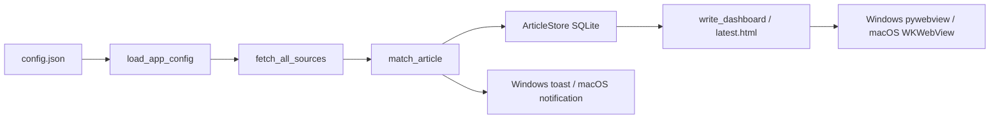

# Paper Monitor 当前功能逻辑与实现原理总结

生成日期：2026-07-14

本文档覆盖并替换旧版总结，按当前仓库状态说明 Paper Monitor 每个主要功能的实现逻辑、模块边界和平台差异。当前架构不是 Electron，也不是纯网页应用；它是共享 Python core 加 Windows pywebview 窗口与原生 C 托盘，再加 macOS Swift/AppKit 壳。

## 1. 总体架构

Paper Monitor 的业务核心集中在 `paper_monitor/` Python 包中。Windows 和 macOS 只是不同的桌面壳层，负责窗口、托盘/菜单、通知、启动项和平台集成。

整体分层如下：

- Python core：读取配置，抓取论文源，过滤匹配，写 SQLite，生成 Dashboard HTML，执行关键词分析。
- Windows 壳：`PaperMonitor.exe` 由 PyInstaller 打包，入口是 `windows/PaperMonitor.pyw`，再进入 `paper_monitor.windows_app.main()`。主界面和设置页通过 pywebview 内置窗口打开；独立的 `PaperMonitorTray.exe` 只负责原生菜单和启动短时 worker，不加载 Python、WebView、网络检索或数据库。
- macOS 壳：Swift/AppKit 应用位于 `macos/PaperMonitorApp`。原生窗口、菜单、状态栏、通知和设置界面由 Swift 实现，业务刷新通过 `PythonBridge` 调用同一套 Python CLI。
- 发布包：Windows 生成 onefile exe 和 release zip；macOS 生成 `.app`，把 Python runtime 和数据文件复制进 app resources，再安装到 Application Support。

核心数据流：

## 2. 配置系统

主配置文件是 `config.json`，默认模板来自 `config.example.json` 和 `paper_monitor.config.DEFAULT_CONFIG`。

核心字段：

- `database_path`：SQLite 数据库路径。
- `dashboard_path`：最新 Dashboard HTML 输出路径。
- `journal_metrics_path`：期刊指标和别名数据。
- `settings_schema_version`：当前至少为 `2`。
- `interval_seconds`：刷新间隔。
- `refresh_start_time`：每天锚定刷新时间，格式为 `HH:MM`，为空时表示不锚定。
- `max_notifications`：每轮最多通知的新论文数。
- `app_settings`：桌面运行设置。
- `search_direction`：检索方向 preset、自定义 query 和手动编辑标记。
- `include_terms` / `exclude_terms`：纳入和排除关键词。
- `journals`：旧字段，仍作为 fallback。
- `journal_scope.top_n` / `journal_scope.selected_journals`：当前主要期刊范围字段。
- `sources.crossref`、`sources.openalex`、`sources.arxiv`、`sources.rss`：各数据源设置。

`load_app_config()` 的原则：

- 相对路径基于 `config.json` 所在目录解析。
- 先读 `journal_scope.selected_journals`，为空时 fallback 到旧字段 `journals`。
- `arxiv` 是 source 选择，不是正式期刊名；写给 Crossref 的 `journal_titles` 会过滤掉 `arxiv`。
- 期刊别名来自 `journal_metrics.json`，用于把 source 返回的期刊名映射到用户选择的标准名。
- `search_direction.crossref_query` 和 `search_direction.openalex_query` 会覆盖对应 source 的 query。
- `refresh_start_time` 非法时在 Python runtime 中会回退为空；Windows/Mac 设置保存时会严格校验。

## 3. 搜索方向 Preset

搜索方向定义在 `paper_monitor/resources/search_direction_presets.json`，Python 通过 `paper_monitor/search_presets.py` 读取，macOS 通过 Swift 的 `SearchPresetCatalog` 读取同一份 JSON。

当前 preset 包括：

- `solid_state_battery_general`
- `solid_electrolyte`
- `lithium_metal_anode`
- `interface_interphase`
- `custom`

实现原则：

- 每个 preset 同时包含 Crossref query、OpenAlex query、include terms、exclude terms。
- `custom` 允许用户手动编辑 Crossref/OpenAlex query。
- 旧 alias 会兼容，例如 `interface_impedance` 映射到 `interface_interphase`，`cathode_materials` 映射到 `custom`。
- Windows Settings 会根据当前 query 反推匹配 preset；如果 query 被手动改动，则提升为 custom。
- macOS SettingsStore 也会识别 alias，并在非手动编辑时把旧 preset 规范化为当前 preset。

## 4. 数据源抓取

数据源入口是 `paper_monitor.sources.fetch_all_sources(source_config)`。它按配置依次抓取 RSS、Crossref、OpenAlex 和 arXiv。单个 source 失败时不会让整轮刷新失败，而是输出 `warning:` 到 stderr，并继续其它 source。

### RSS

RSS 使用 `fetch_url()` 拉取 XML，再用 `parse_rss_feed()` 解析。

逻辑：

- 支持 RSS item 和 Atom entry。
- 标题、链接、摘要、发布时间、DOI 从 feed 节点中提取。
- channel title 和配置里的 feed name 用于推断 journal/source。
- 没有 title 或 url 的条目会被丢弃。

### Crossref

Crossref 是默认启用的数据源。

主要配置：

- `enabled`
- `days_back`
- `rows`
- `rows_per_journal`
- `timeout_seconds`
- `max_workers`
- `retry_count`
- `min_request_interval_seconds`
- `journal_titles`
- `query`
- `mailto`
- `cursor_pagination`
- `max_cursor_pages`
- `date_chunk_days`
- `cache_dir`
- `cache_ttl_seconds`

抓取逻辑：

- `build_crossref_urls()` 根据 query、日期窗口、期刊列表和 rows 生成 API URL。
- 如果有 `journal_titles`，按每个期刊生成查询；否则生成全局查询。
- 日期窗口默认由 `days_back` 推导，也可由 `date_from` / `date_to` 明确指定。
- `date_chunk_days` 可把长时间窗口拆成多个小窗口。
- `query_field` 支持 `bibliographic` 或 `title`。
- `select_fields` 可限制返回字段，用于关键词分析的快速模式。

速率和并发：

- 没有 `mailto` 时按 Crossref public pool 处理：列表请求并发上限为 1。
- 配置 `mailto` 时按 polite pool 处理：列表请求并发上限为 3。
- 默认 request interval：public pool 为 1 秒，polite pool 为 1/3 秒。
- 也可以通过 `min_request_interval_seconds` 覆盖。

稳定性：

- 对 HTTP 429、500、502、503、504 执行指数退避重试。
- 支持 `Retry-After`。
- 可启用本地 cache，用 URL SHA256 作为 cache 文件名。
- 如果返回的是客户端挑战 HTML，会尝试用 curl 再拉一次；仍失败则报错。

解析逻辑：

- `parse_crossref_response()` 读取 Crossref JSON。
- DOI 标准化为小写。
- URL 优先用 Crossref `URL`，否则用 DOI 生成 `https://doi.org/...`。
- `published` 和 `detected` 分别从 published/created/deposited 等字段推断。
- authors 会从 author list 提取。

### OpenAlex

OpenAlex 默认关闭，但 UI 和配置都支持。

当前重要规则：

- `sources.openalex.enabled=true` 时必须提供非空 `api_key`。
- Windows Settings 保存时会校验 API key。
- macOS SettingsStore 保存时也会校验 API key。
- Python `build_openalex_url()` 如果启用但没有 API key，会抛出 `sources.openalex.api_key is required when OpenAlex is enabled`。

抓取逻辑：

- `build_openalex_url()` 生成 `https://api.openalex.org/works` 查询。
- 使用 `search`、`filter`、`per_page`、`sort=publication_date:desc`。
- `select` 只请求需要字段：`id,display_name,doi,publication_date,primary_location,abstract_inverted_index,authorships`。
- `max_pages > 1` 时启用 cursor，从 `meta.next_cursor` 翻页。
- `per_page` 限制为 1 到 200。
- `max_pages` 限制为 1 到 50。

解析逻辑：

- 标题来自 `display_name`。
- 期刊来自 `primary_location.source.display_name`。
- DOI 标准化。
- URL 优先 landing page，其次 DOI URL，再 fallback 到 OpenAlex id。
- abstract 从 inverted index 还原。
- authors 从 authorships 中去重提取。

### arXiv

arXiv 默认关闭。

启用条件：

- `sources.arxiv.enabled=true`，或
- `journal_scope.selected_journals` 中包含 `arxiv`。

抓取逻辑：

- `build_arxiv_url()` 调用 `https://export.arxiv.org/api/query`。
- `search_field` 支持 title/all，配置中的 title 会生成 `ti:(...)`，all 会生成 `all:(...)`。
- `max_results` 限制为 1 到 2000。
- 返回后再按 `days_back` 过滤。

解析逻辑：

- 使用 Atom XML。
- journal 固定为 `arXiv`。
- title、summary、published、updated、authors 和 DOI 从 entry 提取。

## 5. 论文身份、去重和匹配

论文模型是 `paper_monitor.models.Article`。

身份规则：

- 如果有 DOI，identity 为 `doi:<normalized-doi>`。
- 如果没有 DOI，identity 为 `title-url:<normalized-title>|<normalized-url>`。

一轮刷新中的去重：

- `run_once()` 维护 `seen_identities`。
- 同一轮里重复 identity 会被计为 skipped。

跨轮去重：

- SQLite `articles.identity` 是主键。
- 新匹配论文插入失败时说明已存在，此时更新元数据但不计入新通知。

匹配规则在 `paper_monitor/filtering.py`：

1. 把 title、abstract、journal 合并为 searchable text。
2. 文本规范化：小写、连字符转空格、压缩空白。
3. 先检查 exclude terms；命中即 `excluded-term`。
4. 再检查 journal allowlist 和 aliases；不在范围内即 `journal-not-allowed`。
5. 最后检查 include terms；没有命中即 `no-include-term`。
6. 有 include term 且期刊允许，则结果为 `matched`。

关键词匹配使用空格边界正则，降低短词误命中长词的概率。

## 6. 刷新主流程

应用级刷新入口是 `paper_monitor.app_refresh.run_app_refresh(config_path)`。

流程：

1. `load_app_config()` 读取并规范化配置。
2. 创建 `ArticleStore`。
3. 调用 `run_once()`。
4. `run_once()` 创建一条 `runs` 记录，状态为 `running`。
5. 调用 `fetch_all_sources()` 获取文章。
6. 对每篇文章去重、匹配，并写入 `candidates`。
7. 对匹配论文调用 `add_new_articles()` 写入 `articles`。
8. 只对新增文章触发通知 capture，数量受 `max_notifications` 限制。
9. 成功时 `finish_run(status="finished")`。
10. 异常时 `fail_run(status="failed")`，避免残留 `running`。
11. 加载期刊指标，生成 Dashboard HTML。
12. 返回 JSON：run id、抓取数量、匹配数量、新增数量、跳过数量、Dashboard 路径、待通知文章列表。

普通 CLI `paper-monitor run` 和桌面 app `app-refresh` 共用同一套 `run_once()`，区别只是通知方式和输出格式。

## 7. SQLite 存储

存储由 `paper_monitor.storage.ArticleStore` 实现。

数据库表：

- `articles`：已匹配并保存过的论文，identity 为主键。
- `runs`：每次刷新记录，包含 started/finished/status/fetched/matched/new/skipped/error_message。
- `candidates`：每轮抓取到的候选论文，包括 matched、reason、matched_terms、journal_match。

设计意图：

- `articles` 用于跨轮去重和 recent 列表。
- `runs` 用于 Dashboard 总览和失败状态追踪。
- `candidates` 用于 Dashboard 展示匹配/拒绝原因，也用于关键词分析。

兼容迁移：

- 初始化时会创建缺失表。
- 会补充旧数据库缺失的 `detected` 和 `error_message` 列。
- 旧记录 `detected` 为空时会回填为 `published`。

错误处理：

- 每个数据库连接在 context manager 中提交。
- 发生异常时 rollback。
- run 失败时 error message 会压缩并截断到 500 字符。

## 8. Dashboard 主界面

Dashboard 由 `paper_monitor/dashboard.py` 生成静态 HTML，写入 `dashboard_path`。

展示内容：

- 最近一次运行状态。
- Fetched、Matched、New notifications、Skipped、Selected journals。
- Matched Papers。
- Rejected Candidates。
- Keyword Analysis 区域。

排序和分析：

- 匹配论文可按时间或影响因子排序。
- Keyword Analysis 可以按日期、期刊、术语、排序模式、分析深度筛选。
- Dashboard 本身是静态 HTML，但 Windows 和 macOS 壳会注入不同的 bridge，使按钮能调用本地功能。

当前 UI 边界：

- Dashboard 顶部不显示 Build/hash 标签。
- Windows 右键托盘和双击托盘打开的是内置应用窗口，不是系统浏览器。
- Settings 页面左上角返回文案是 `Main Window`。

## 9. 关键词分析

关键词分析分两层：

- `paper_monitor.analysis_refresh.run_crossref_keyword_analysis()`：按用户选择的日期/期刊临时抓 Crossref。
- `paper_monitor.keyword_analysis.build_keyword_analysis_payload()`：对候选论文分类、统计、发现候选关键词。

Crossref 分析模式：

- `fast`：query field 使用 title，select 字段较少，最多一页，cache TTL 较长。
- `exhaustive`：query field 使用 bibliographic，启用 cursor pagination，按月份拆分日期，最多 100 页，cache TTL 较短。

分析流程：

1. 读取当前 config。
2. 构造只启用 Crossref 的 source_config。
3. 指定 date_from/date_to、selected_journals、analysis_depth、top_n。
4. 抓取 Crossref 候选文章。
5. 对候选文章套用同一套 `match_article()`。
6. 构建 candidates payload。
7. 按 `AnalysisScope` 筛选论文。
8. 用 taxonomy 分类。
9. 从标题/摘要/匹配词中发现 candidate terms。
10. 返回 JSON 给 Dashboard。

分类原理：

- taxonomy 由 `TaxonomyCategory` 定义，包含主类名和 aliases。
- 文本先规范化，再用词和短语规则匹配。
- candidate term 发现会过滤 blocklist、低价值词、出版元数据词和过宽泛词。

并发控制：

- Windows bridge 对 `/api/analyze-keywords` 使用 `_ANALYSIS_LOCK`。
- 已有分析运行时返回 HTTP 409 和 `analysis_already_running`。
- macOS `DashboardCommandController` 用 `keywordAnalysisTask` 防重复。

## 10. Windows 桌面壳

Windows 入口：

- 打包入口：`windows/PaperMonitor.pyw`。
- 命令入口：`paper_monitor.windows_app.main()`。
- 图形窗口：`paper_monitor.windows_app_window.open_dashboard_window()`。
- 托盘 Adapter：`windows/native_tray/paper_monitor_tray.c` 编译为独立的 `PaperMonitorTray.exe`。

命令行为：

- `PaperMonitor.exe` 或 `PaperMonitor.exe window`：打开主应用窗口。
- `PaperMonitor.exe settings`：打开设置窗口。
- `PaperMonitor.exe scheduled-refresh`：执行一次无窗口的后台刷新并退出。
- `PaperMonitor.exe sync-runtime`：按配置同步 Windows 任务计划并清理旧 Run 注册表项。
- `PaperMonitor.exe install-startup`：兼容命令，用于启用非驻留任务计划。
- `PaperMonitor.exe uninstall-startup`：兼容命令，用于禁用非驻留任务计划。
- `PaperMonitor.exe test-notification`：发送测试通知。
- 如果主窗口已经存在，`window`/`settings` 命令通过本地控制通道切换现有窗口并聚焦，不再静默退出或创建第二个窗口。

内置窗口原理：

- `windows_app_window.py` 启动 `WindowsDashboardServer`。
- pywebview 创建窗口，URL 指向本地 `127.0.0.1` server。
- 主窗口 path 为 `/`。
- 设置窗口 path 为 `/settings`。
- 关闭窗口时停止对应 server。

托盘行为：

- 原生 C 托盘启动时获取 Windows mutex `Local\PaperMonitorTray`，防止多个托盘实例。
- 托盘不读取数据库、不执行网络检索，也不创建 Python 或 WebView 运行时。
- `app_settings.show_tray_icon` 控制托盘是否运行；设置保存后会立即启动或退出托盘。
- 菜单项包括：
  - `Open Paper Monitor`
  - `Settings...`
  - `Refresh Now`
  - `Test Notification`
  - `Quit Tray`
- 原生窗口过程只在收到 `WM_LBUTTONDBLCLK` 时触发 `Open Paper Monitor`，单击不会误触发菜单动作。
- 每个菜单动作只启动一个有界的 `PaperMonitor.exe` worker；`Refresh Now` 使用与任务计划相同的后台 Refresh Execution。
- `Open Paper Monitor` 和 `Settings...` 不调用系统浏览器；没有窗口时启动 pywebview，有窗口时通过本地控制通道复用同一个窗口并切换 `/` 或 `/settings`。

后台计划：

- 新版本不写入登录 Run 注册表；同步设置时只清理旧版本残留的 Run 值。
- 设置保存后 `sync_windows_runtime_settings()` 按 `startup_enabled` 同步当前用户的 Windows 任务计划。
- 任务到期时启动一次 `scheduled-refresh`，刷新、存储和通知完成后退出。
- 免安装版只要路径保持有效，同样可以注册任务计划；移动或删除程序后需要重新同步任务。

通知：

- Windows 通知使用 `win11toast`。
- 通知标题为论文标题，副标题/正文包含 journal 和 DOI/URL。
- 点击通知优先打开 article URL，其次 DOI URL，再 fallback 到 Dashboard 文件。
- Windows 后台通知只由 `notifications_enabled` 和 Article Lifecycle 的通知状态控制，不再存在托盘启动刷新。

## 11. Windows 本地 HTTP Bridge

`WindowsDashboardServer` 是 Windows 内置窗口背后的本地服务。

安全边界：

- 默认 host 是 `127.0.0.1`。
- 每个 server 实例生成随机 token。
- API 请求必须带 `X-Paper-Monitor-Token`。
- Dashboard HTML 只注入 base URL 和 token，不注入 OpenAlex API key。

路由：

- `GET /`：生成并返回 Dashboard。
- `GET /settings`：返回 Settings 页面。
- `GET /api/settings`：返回设置 payload。
- `GET /api/settings/defaults`：返回默认设置 payload。
- `POST /api/settings`：保存设置。
- `POST /api/add-search-term`：添加 include term。
- `POST /api/refresh-now`：手动刷新。
- `POST /api/analyze-keywords`：关键词分析。

刷新并发：

- `/api/refresh-now` 使用 `_REFRESH_LOCK`。
- `run_app_refresh()` 还使用 `Local\PaperMonitorRefresh` Windows 命名 guard，阻止托盘、Dashboard 和 CLI 跨进程并发刷新。
- 已在刷新时返回 HTTP 409 和 `refresh_already_running`。

写配置：

- `save_settings()` 和 `add_include_term()` 都通过 `update_config_atomic()`。
- 写入流程是读 JSON、mutate、写 backup、写临时文件、flush/fsync、atomic replace。
- 这样降低设置保存与 Dashboard 添加术语同时发生时的数据丢失风险。

Dashboard 注入：

- bridge 注入 Settings 链接。
- bridge 注入 Refresh Now 按钮处理逻辑。
- 不注入 Build/hash 标签。

## 12. Windows Settings 页面

Settings 页面资源已拆到包内资源文件：

- `paper_monitor/templates/windows/settings.html`
- `paper_monitor/static/windows/settings.css`
- `paper_monitor/static/windows/settings.js`

渲染逻辑：

- `render_settings_page()` 读取模板、CSS、JS。
- 用 `__SETTINGS_CONTEXT__` 注入 base URL 和 token。
- 不依赖当前工作目录，适合 PyInstaller onefile 资源读取。

页面结构：

- Search Settings
- App Settings
- Search Terms
- Journal Filter

Search Settings：

- Top N Journals。
- Refresh Frequency。
- Start Refresh Time。
- Search Direction preset。
- Custom Direction Name。
- Crossref Query。
- OpenAlex Query。
- Max Notifications。
- Source Options 高级设置。

Source Options：

- Crossref enabled/days/rows/rows per journal/timeout/workers/mailto。
- OpenAlex enabled/days/per page/pages/API key。
- arXiv enabled/days/max results/search field/timeout/query。

App Settings：

- Launch at Startup。
- Tray Icon。
- Notifications。
- Quiet Startup。
- Launch Refresh。

Search Terms：

- include terms。
- exclude terms。

Journal Filter：

- 左侧 selected journals。
- 右侧 candidate journals。
- 支持搜索、按 impact factor/rank/name 排序。
- 支持手动添加 journal。

保存校验：

- 整数范围来自 `INT_RANGES`。
- 列表长度来自 `LIST_LIMITS`。
- `refresh_start_time` 必须为空或 `HH:MM`。
- OpenAlex enabled 时 `api_key` 必填。
- custom Crossref query 必填。
- custom OpenAlex query 在 OpenAlex disabled 时可以为空。
- 保存后 `settings_schema_version` 至少为 2。
- 未知 future keys 会尽量保留。

## 13. macOS 桌面壳

macOS 源码在 `macos/PaperMonitorApp`。

主要模块：

- `AppDelegate.swift`：应用生命周期、菜单、刷新、通知、设置窗口、Dashboard 窗口。
- `PythonBridge.swift`：调用共享 Python CLI。
- `SettingsStore.swift`：读写 `config.json`。
- `SettingsModels.swift`：设置模型和 normalizer。
- `SearchSettingsViewController.swift`、`SearchTermsViewController.swift`、`JournalFilterViewController.swift`、`AppSettingsViewController.swift`：原生设置 UI。
- `DashboardWindowController.swift`：WKWebView 主窗口。
- `DashboardCommandController.swift`：Dashboard JS 到 Swift 的 bridge。
- `RefreshScheduler.swift`：刷新调度。
- `BundledRuntimeInstaller.swift`：安装 bundled Python runtime。
- `NotificationController.swift`：macOS 通知。
- `LaunchAtLoginController.swift`：macOS 登录启动。

应用启动：

1. `AppDelegate.applicationDidFinishLaunching()` 检查是否已有实例。
2. 如已有实例，则向运行实例发出打开 Dashboard 或测试通知请求，并退出当前进程。
3. 安装主菜单。
4. 调用 `BundledRuntimeInstaller.installFromMainBundle()` 把 Python runtime 和数据文件复制到 Application Support。
5. 读取 runtime settings。
6. 同步登录启动状态。
7. 配置状态栏图标。
8. 注册打开 Dashboard 和测试通知的跨实例事件。
9. 根据设置调度刷新。
10. 请求通知权限，并按配置决定是否启动后刷新。

Application Support 路径：

- `~/Library/Application Support/PaperMonitor`

runtime 安装：

- 复制 `paper_monitor/` 到 Application Support。
- 复制 `config.example.json`、`journal_metrics.json`、`README.md`。
- 如果用户没有 `config.json`，才从 `config.example.json` 初始化。
- 已存在的 `paper_monitor/` runtime 会被覆盖，用户配置不会被覆盖。

## 14. macOS PythonBridge

macOS 不直接重写业务逻辑，而是通过 `PythonBridge` 调用 Python CLI。

命令：

- 刷新：`python3 -m paper_monitor.cli app-refresh --config <config.json>`
- 渲染 Dashboard：`python3 -m paper_monitor.cli render-dashboard --config <config.json>`
- 关键词分析：`python3 -m paper_monitor.cli analyze-keywords --config <config.json> ...`

环境：

- `currentDirectoryURL` 设置为 Application Support。
- `PYTHONPATH` 指向 Application Support，使复制过去的 `paper_monitor` 包可被导入。

超时：

- refresh：120 秒。
- render dashboard：30 秒。
- keyword analysis：180 秒。

错误处理：

- Python 不存在或不可执行：`pythonMissing`。
- 超时：先 terminate，仍不退出再 SIGKILL。
- 非 0 退出：读取 stderr 并上抛。
- stdout 解析为 JSON。
- stderr 中以 `warning:` 开头的行会收集进 warnings。

## 15. macOS Dashboard 和设置

Dashboard：

- 使用 `WKWebView` 加载 Python 生成的本地 HTML 文件。
- 外部链接由 `DashboardNavigationPolicy` 判断后用 `NSWorkspace.shared.open()` 打开。
- Dashboard 内部命令通过 `WKScriptMessageHandler` 发送给 `DashboardCommandController`。

Dashboard 支持的命令：

- `addSearchTerm`：调用 `SettingsStore.addIncludeTerm()`。
- `analyzeKeywords`：调用 `PythonBridge.analyzeKeywords()`，并把 JSON 回调给 JS。
- `refreshNow`：调用 `PythonBridge.refresh()`，成功后更新菜单状态和通知。

设置：

- macOS 设置是 AppKit 原生窗口，不是网页。
- `SettingsStore.load()` 读取 JSON 并填充 `AppSettings`。
- `SettingsStore.save()` 保存时会保留未知字段。
- 期刊选择写入 `journal_scope.selected_journals`，同时更新旧字段 `journals` 以兼容旧逻辑。
- Crossref 的 `journal_titles` 会剔除 `arxiv`。
- OpenAlex 设置包括 enabled、days_back、per_page、max_pages、api_key。
- OpenAlex enabled 且 API key 为空时，保存失败并显示错误。

macOS 调度：

- `RefreshScheduler.schedule(interval:startTime:)` 支持普通 interval 和每日锚点。
- `refresh_start_time` 为空时按 interval 重复。
- `refresh_start_time` 非空时计算下一个 HH:MM 锚点，然后按 interval 递推。
- 设置保存后如果 interval 或 start time 改变，会重新调度。

macOS 通知：

- 使用 UserNotifications。
- 通知点击优先打开 article URL。
- 通知 action `Open Dashboard` 会打开 dashboard URL。
- `notifications_enabled` 控制是否发通知。
- `silent_startup_notifications` 控制启动刷新是否静默。

macOS 状态栏：

- `show_tray_icon` 控制是否显示状态栏 item。
- 菜单包含 Open Dashboard、Settings、Refresh Now、Quit。

## 16. 跨平台一致性

两端共享：

- `config.json` schema。
- `paper_monitor/` core。
- `journal_metrics.json`。
- `search_direction_presets.json`。
- Dashboard HTML 生成逻辑。
- Crossref/OpenAlex/arXiv source 逻辑。
- 匹配和关键词分析逻辑。

两端不同：

- Windows Settings 是 HTML/CSS/JS，经本地 HTTP bridge 保存。
- macOS Settings 是 AppKit 原生 UI，直接通过 SettingsStore 保存。
- Windows 主窗口是 pywebview 加本地 HTTP server。
- macOS 主窗口是 WKWebView 加本地文件。
- Windows 通知用 win11toast。
- macOS 通知用 UserNotifications。
- Windows 登录启动用 HKCU Run 注册表。
- macOS 登录启动用 SMAppService。

一致性原则：

- 保存设置时 `settings_schema_version` 至少为 2。
- 未知字段尽量保留，减少跨版本配置损坏。
- `journal_scope.selected_journals` 是主字段，`journals` 是兼容字段。
- `arxiv` 是 source 选择，不传给 Crossref 作为期刊名。
- OpenAlex 在两端都要求 enabled 时必须有 API key。

## 17. 命令行功能

`paper_monitor.cli` 提供以下命令：

- `init`：写默认 config。
- `run`：抓取、过滤、通知、生成 Dashboard。
- `app-refresh`：桌面 app 用刷新入口，输出 JSON。
- `render-dashboard`：根据数据库最新 run 重新生成 Dashboard，输出 JSON。
- `analyze-keywords`：执行 Crossref 关键词分析，输出 JSON。
- `recent`：打印最近存储的匹配论文。
- `open-dashboard`：生成并用系统默认浏览器打开最新 Dashboard；这是 CLI 调试入口，不是 Windows 托盘主界面入口。
- `write-launch-agent`：生成 macOS LaunchAgent plist。
- `test-notification`：发送测试通知。

## 18. Windows 打包和安装

构建脚本：

- `scripts/build_windows_app.ps1`

构建逻辑：

- 自动选择真实 Python，避开 Microsoft Store alias。
- 生成 Windows icon。
- 调用 PyInstaller。
- 使用 `--noconsole --onefile`。
- 入口为 `windows/PaperMonitor.pyw`。
- 打包资源包括：
  - `config.example.json`
  - `journal_metrics.json`
  - `windows/assets/PaperMonitor.ico`
  - `paper_monitor/templates`
  - `paper_monitor/static`
  - `paper_monitor/resources`
- hidden imports 只保留运行期需要的 SQLite、Unicode、win11toast、webview 和 Windows webview backends；Pillow 仅供构建图标使用，不再强制打入运行包。
- 排除非 Windows webview backend。

发布脚本：

- `scripts/package_windows_release.ps1`

发布逻辑：

- 默认先完整 build，除非显式 `-SkipBuild`。
- 创建 `public_release/Paper-Monitor-Windows-<version>/` staging 目录。
- staging 中包含：
  - `PaperMonitor.exe`
  - `Install-PaperMonitor.ps1`
  - `README_WINDOWS.md`
  - `config.example.json`
  - `journal_metrics.json`
  - `SHA256SUMS.txt`
- 生成 zip。
- 同时复制一份独立 exe 到 public_release。
- 生成外层 `SHA256SUMS-<version>.txt`。

安装脚本：

- `windows/Install-PaperMonitor.ps1`

安装逻辑：

- 从 zip 解压目录复制 `PaperMonitor.exe` 到 `%LOCALAPPDATA%\Programs\PaperMonitor\PaperMonitor.exe`。
- 复制 `config.example.json` 和 `journal_metrics.json` 到 `%APPDATA%\PaperMonitor`。
- 如果用户没有 `config.json`，从 example 初始化。
- 安装前会只停止已安装路径对应的旧 `PaperMonitor.exe`，避免旧进程占用或继续显示旧 UI。
- 只有用户选择启用后台监控时才调用 `install-startup` 注册非驻留任务计划。
- 不再创建或启动 Python 托盘进程。
- 只有用户选择安装后启动时才打开主窗口；主窗口再按设置启动原生 C 托盘。

当前 Windows release 由 `public_release/CURRENT_WINDOWS_RELEASE.txt` 指向；对应 SHA256 以同目录的 `SHA256SUMS-<version>.txt` 为准，避免文档保留过期构建号。

## 19. macOS 打包

脚本：

- `scripts/build_macos_app.sh`

逻辑：

- 设置 `COPYFILE_DISABLE=1`，减少 AppleDouble 文件。
- 进入 `macos/PaperMonitorApp`。
- 生成 app icon。
- `swift build -c release`。
- 创建 `dist/Paper Monitor.app`。
- 复制 Swift 可执行文件到 `Contents/MacOS/PaperMonitorApp`。
- 复制 `Info.plist` 和 icon。
- 复制 `paper_monitor/`、`config.example.json`、`journal_metrics.json`、`README.md` 到 resources。
- 排除 `__pycache__`、`.DS_Store`、`._*`、`__MACOSX`。
- 清理 app bundle 中可能残留的 AppleDouble 文件。
- `codesign --force --deep --sign -` 做 ad-hoc 签名。

注意：

- macOS 构建和 `swift test` 必须在 macOS 上运行。
- 当前 Windows 环境不能验证 AppKit 编译和真实 `.app` 启动。

## 20. 测试覆盖

Python 测试位于 `tests/`。

当前主要覆盖：

- 配置 contract。
- search preset 读取、alias 和默认值。
- Windows Settings 页面资源加载。
- Windows 设置保存校验。
- OpenAlex API key 必填。
- 自定义 Crossref-only 允许 OpenAlex query 为空。
- Crossref polite/public pool 并发和限速。
- run 失败状态。
- Dashboard Refresh Now bridge。
- 关键词分析并发保护。
- Windows 托盘打开内置窗口而不是浏览器。
- Windows Build 标签已从界面移除。
- Windows 打包资源包含 templates/static/resources。

最近一次本地验证：

- Python tests：运行 `python -m unittest discover -s tests`，以当前输出为准。
- Windows release zip 解压后 `PaperMonitor.exe --help`：退出码 0。
- Dashboard build badge：不存在。
- Settings build identity：不存在。

## 21. 当前风险和待验证项

Windows：

- pywebview 依赖 WebView2/Windows webview backend，发布前仍需在干净 Windows 用户环境中打开窗口验证。
- 托盘双击使用 Windows `WM_LBUTTONDBLCLK` 专用 handler，发布前仍需对真实通知区域右键、双击和 Explorer 重启恢复做人工验收。
- `win11toast` 通知受 Windows 通知权限和系统策略影响。
- Authenticode 签名需要外部可信代码签名证书和 Windows SDK；没有证书时只能生成未签名开发包，公共发布应使用 `-RequireSignature`。

macOS：

- 需要在 macOS 上运行 `cd macos/PaperMonitorApp && swift test`。
- 需要运行 `./scripts/build_macos_app.sh`。
- 需要验证 `.app` 首次启动、Application Support runtime 安装、设置保存、刷新、通知和 Dashboard 命令。
- 需要检查 macOS zip 不含 `._*`、`.DS_Store`、`__MACOSX`。

API/source：

- OpenAlex 当前要求 API key，这是显式产品契约；发布说明和验收都应按此执行。
- Crossref 大范围 exhaustive 分析可能耗时较长，因此有 cache、retry、pagination 和超时控制，但仍依赖网络稳定性。

配置：

- 用户已有 `config.json` 不会被安装脚本覆盖，因此升级后默认配置变化不会自动替换用户配置。
- 这有利于保护用户配置，但也意味着新增默认 query/source 参数需要通过 Settings 或手动迁移进入旧配置。

## 22. 当前设计原则

- 共享业务逻辑留在 Python core，避免两端各写一套抓取/过滤/分析。
- Windows 和 macOS 使用各自平台合适的壳层，不强行合并 UI。
- 配置保存尽量原子化，并保留未知字段。
- source 失败尽量降级为 warning，不让单个源拖垮整个刷新。
- 论文去重以 DOI 优先，没有 DOI 时用 title + URL。
- DOI identity 会移除 resolver 前缀、fragment 和出版商链接附带的查询参数；`ArticleLifecycle` 在同一事务中合并旧的精确别名记录，并保留展示、通知和刷新状态。
- Dashboard 可以是 HTML，但桌面入口应表现为本地应用窗口；Windows 托盘不再打开系统浏览器作为主界面。
- 发布包需要可重复构建、可哈希校验、可在干净用户目录安装验证。
