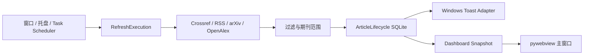

# Paper Monitor 当前架构与功能逻辑

更新日期：2026-07-31

Paper Monitor 现为 Windows-only 桌面应用。仓库不再包含其他平台的壳层、打包脚本、测试或发布流程。

## 1. 总体结构

主要目录：

- `paper_monitor/`：配置、来源检索、匹配、SQLite 生命周期、Dashboard、设置和 Windows 运行时逻辑。
- `windows/`：无控制台入口、原生 C 托盘、Inno Setup 安装器和 Windows 图标。
- `scripts/`：Windows 构建、打包、安装辅助和目录维护脚本。
- `tests/`：Python、JavaScript 契约、调度、通知、生命周期和稳定性测试。
- `.github/workflows/`：质量检查、Windows 测试和 Windows 发布构建。

运行时由三个有清晰 interface 的 Module 组成：

1. `RefreshExecution`：执行一轮有界检索。
2. `ArticleLifecycle`：原子维护文章、刷新、展示和通知状态。
3. Windows shell：窗口、托盘、任务计划和 Toast Adapter。

`RefreshExecution` 和 `ArticleLifecycle` 是共享 seam。主窗口刷新、托盘刷新和计划任务都通过同一 interface 写入同一 SQLite 数据库，不再维护独立缓存或通知队列。


```mermaid
flowchart LR
    Trigger["窗口 / 托盘 / Task Scheduler"] --> Refresh["RefreshExecution"]
    Refresh --> Sources["Crossref / RSS / arXiv / OpenAlex"]
    Sources --> Match["过滤与期刊范围"]
    Match --> Lifecycle["ArticleLifecycle SQLite"]
    Lifecycle --> Toast["Windows Toast Adapter"]
    Lifecycle --> Snapshot["Dashboard Snapshot"]
    Snapshot --> UI["pywebview 主窗口"]
```

## 2. Windows 进程模型

- `PaperMonitor.exe window` 打开 pywebview Dashboard/Settings 窗口。
- `PaperMonitorTray.exe` 是轻量原生 C 托盘，不加载 Python、WebView、网络或数据库实现。
- `PaperMonitor.exe scheduled-refresh` 执行一轮无窗口后台刷新后退出。
- 关闭主窗口会释放 Python、WebView 和本地 HTTP bridge。
- 可选登录任务只启动托盘，不打开窗口，也不立即检索。
- 同一窗口通过命名 mutex 和本地 window-control channel 复用；重复启动会聚焦已有窗口。

## 3. 配置

公共默认值位于 `paper_monitor/config.py` 和 `config.example.json`，公开结构由 `docs/config.schema.json` 约束。

关键默认值：

- `interval_seconds = 86400`：一天一次。
- `refresh_start_time = "09:00"`：本地确定开始时间。
- `app_settings.startup_enabled`：后台监控。
- `app_settings.launch_at_login`：登录后只启动托盘。
- `app_settings.notifications_enabled`：新文章通知。

设置保存由 `paper_monitor/windows_settings.py` 处理：

- 校验字段类型和组合。
- 保留未知 future keys。
- 把 `settings_schema_version` 至少提升到 2。
- 期刊选择只以 `journal_scope.selected_journals` 为准。
- Crossref 的 `journal_titles` 在运行时从明确选择派生。
- 启用 OpenAlex 时必须提供 API key。
- 保存成功后同步当前用户的 Windows 计划任务。

## 4. 检索方向

`paper_monitor/resources/search_direction_presets.json` 是检索方向的单一数据源，`paper_monitor/search_presets.py` 负责加载和规范化。

内置方向包括：

- 全固态电池综合
- 硫化物固态电解质
- 卤化物固态电解质
- LATP
- LLZO/LLZTO
- 硅负极
- 钠电池
- 自定义

选择 preset 时会同时应用：

- Crossref query
- OpenAlex query
- include terms
- exclude terms

因此来源检索与本地匹配使用同一研究方向，不会出现“查询已切换但过滤词仍是旧值”的分裂状态。

## 5. 来源与速度

来源入口是 `paper_monitor.sources.fetch_all_sources()`。

- Crossref 支持按明确期刊并发请求、分页、超时、重试和磁盘缓存。
- 没有 `mailto` 时使用公共池安全并发；配置 `mailto` 后可使用 polite pool。
- RSS、arXiv 和 OpenAlex 可独立启停。
- 单个来源失败会形成 source status；只要仍有来源成功，整轮标记为 partial 而不是丢弃成功结果。
- 全部来源失败时记录 failed run，不提交虚假的成功状态。
- Crossref 缓存限制为 64 MiB / 512 文件并自动清理。

检索速度主要通过有界并发、缓存复用、按期刊请求和避免 UI 打开时重复联网实现。Dashboard 打开只读本地数据库。

## 6. 一轮刷新

`RefreshExecution.execute(intent)` 只暴露 `Background` 与 `Visible` 两种 intent。

流程：

1. 获取进程锁与 Windows 命名 mutex。
2. 读取配置并建立取消令牌。
3. 检索所有启用来源。
4. 按期刊、include terms 和 exclude terms 匹配。
5. 规范化 DOI 与 URL，生成紧凑 `ArticleDetection`。
6. 在一个事务中调用 `ArticleLifecycle.commit_refresh()`。
7. Background intent 通过 `deliver_notification()` 交给 Windows Toast Adapter。
8. Visible intent 返回 `DashboardSnapshot`。
9. 释放取消句柄、mutex 和进程锁。

卸载或升级可发出协作式取消信号；刷新会在来源、循环和提交前的 checkpoint 停止，避免强制终止造成半写入。

## 7. SQLite 生命周期

`ArticleLifecycle` 是文章状态的唯一所有者。

它原子维护：

- 规范化文章身份
- 首次检测时间
- 来源发表日期
- 30 天活动保留
- 刷新 run 状态与来源诊断
- 展示确认
- 通知 eligible / accepted / rejected / ambiguous 状态

通知与主界面共用同一记录：

- 已展示文章不会再通知。
- 已被 Windows 接受或交付状态不确定的通知不会重复发送。
- 明确拒绝的通知可重试。
- 后台刷新完成后，主窗口下一次读取会清除内存快照并直接从生命周期数据库重建。

## 8. Dashboard

`paper_monitor/lifecycle_dashboard.py` 把 `DashboardSnapshot` 转换为 Dashboard 输入；`paper_monitor/dashboard.py` 负责 HTML、CSS 和 JavaScript。

首页行为：

- 按 `first_detected_at` 倒序和分组，保证刚检索到的论文出现在第一页。
- `Detected` 与 `Published` 分别显示；来源只有年月时保持年月精度。
- 首屏最多显示 50 篇，并确保同一日期分组不被切断。
- 只有确实存在剩余文章时才显示 `Show older papers`。
- 支持按时间、影响力或相关性排序。
- 不在首页存储或显示摘要。

Windows bridge：

- 只监听 `127.0.0.1`。
- 每次运行使用随机 token。
- 修改请求必须提供 `X-Paper-Monitor-Token`。
- Host header、请求体大小和安全响应头均受检查。
- 后台 refresh-complete 事件会同时使 pending snapshot 和 dashboard cache 失效。

## 9. Keyword Analysis

关键词分析只在打开相应页面后初始化，避免拖慢首次显示。

- 日期范围和期刊范围受设置中的明确选择约束。
- 支持 fast / exhaustive 深度。
- 支持候选词、屏蔽词、分类词库和趋势表。
- 同一时间只运行一个分析任务；重复请求返回 409。
- 结果与来源诊断返回给当前窗口，不建立第二套文章生命周期。

## 10. Windows 调度

`paper_monitor/windows_scheduled_task.py` 生成当前用户 Task Scheduler XML。

- Start Time 是确定的本地时间，不是偏好值。
- 一天一次时，任务从下一个设定时间开始。
- 两天一次时，从设定时间锚点按 48 小时递推。
- 错过的任务在 Windows 可用后执行。
- 重叠启动被忽略。
- 失败任务按配置重试。
- 不唤醒睡眠电脑。
- 不要求管理员权限。

设置保存后，`windows_runtime_settings.py` 比较所需定义与现有任务；没有实质变化时不重建任务。

## 11. Windows 通知

`WindowsSummaryNotificationAdapter` 是 `ArticleLifecycle.NotificationAdapter` seam 上的 Windows Adapter。

- 每篇新文章一个紧凑 Toast。
- 同一天的 Toast 使用相同 group。
- 标题最多两行，下面显示期刊。
- 点击打开论文 URL；没有 URL 时回退 DOI 或 Dashboard。
- 最多发送设置允许的 1–20 条。
- 使用 `DaheLabs.PaperMonitor` AppUserModelID。

通知文章与 Dashboard 文章来自同一事务提交，因此不会再出现“通知有文献而程序数据库没有文献”的双体系。

## 12. 构建、安装与升级

`scripts/package_windows_release.ps1` 生成：

- `Paper-Monitor-Windows-<version>-Setup.exe`
- `Paper-Monitor-Windows-<version>.zip`
- `Paper-Monitor-Windows-<version>.exe`
- `SHA256SUMS-<version>.txt`

构建过程：

1. 从 `windows/assets/AppIconSource.png` 生成多尺寸 ICO。
2. 编译原生托盘。
3. 用 PyInstaller 生成 onedir 与 onefile。
4. 从 onedir 生成便携 ZIP。
5. 用 Inno Setup 生成当前用户安装器。
6. 校验 ProductVersion、FileVersion 和 SHA256。

安装器使用稳定 AppId，因此检测到旧版时执行升级；也可先从“已安装的应用”卸载旧版再安装。升级和卸载会清理任务与旧进程，但默认保留 `%APPDATA%\PaperMonitor` 中的配置、数据库和缓存。

公开签名构建需要可信 Authenticode 证书；本地无证书构建可用于测试，但 Windows 会显示未知发布者。

## 13. 验证

核心验证命令：

```powershell
python -m ruff check paper_monitor scripts tests windows
python -m bandit -q -r paper_monitor scripts windows -x tests -s B105,B404,B603,B607,B608,B110
python -m coverage run -m unittest discover -s tests
python -m coverage report --fail-under=70
python -m pip_audit -r requirements-windows.lock.txt --no-deps --disable-pip --progress-spinner off
.\scripts\package_windows_release.ps1 -Version 0.1.16
```

冻结产物还应执行：

```powershell
.\dist\windows\PaperMonitor\PaperMonitor.exe self-test
.\dist\windows\PaperMonitor.exe self-test
```

不需要重启电脑，也不需要管理员权限。真实 Authenticode 信任、Windows 通知策略和干净虚拟机安装仍属于发布前人工验收项。
