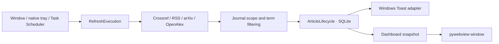

# Paper Monitor

[中文说明](README.zh-CN.md) · [Windows installation and packaging](README_WINDOWS.md)

Paper Monitor is a Windows-only, local-first desktop app for tracking newly published research. It searches Crossref, RSS, optional arXiv, and optional OpenAlex sources, filters papers against an explicit journal scope and research terms, and commits every result to one shared SQLite article lifecycle.

The default presets cover all-solid-state batteries, sulfide and halide solid electrolytes, LATP, LLZO/LLZTO, silicon anodes, and sodium batteries. The bundled 300-journal catalog spans AI, computing, engineering, health, life science, physical science, and social science. Search terms, journal scope, and research directions remain fully configurable. Paper Monitor needs no cloud backend or LLM service, and it does not upload your reading history.

## Architecture



1. Every scheduled, tray, or visible refresh enters the same bounded `RefreshExecution`. It owns one run from global locking and source acquisition through filtering, persistence, and intent-appropriate notification delivery.
2. Sources use bounded concurrency, timeouts, retries, and a capped Crossref disk cache. A partial source failure preserves results from successful sources and records source-level diagnostics.
3. `ArticleLifecycle` is the sole owner of article identity, first-detected time, presentation state, notification acceptance, refresh diagnostics, and retention. These decisions are committed atomically to one SQLite database.
4. The Dashboard reads a local lifecycle snapshot rather than starting another search. A completed background refresh invalidates stale in-memory snapshots, so notified papers are available in the visible app on its next read.
5. The timeline is ordered and grouped by first-detected time so newly found papers remain visible on the first page. Source publication dates are displayed separately and retain their original precision. Active records are permanently deleted after 30 days.

Task Scheduler wakes a short-lived refresh worker only when a scan is due. The Python/WebView UI exits when its window closes. An optional native C tray can remain available without owning retrieval or database state, and a separate sign-in task can start only that tray without opening the app or immediately accessing the network.

## Features

- Native Windows Dashboard and Settings window with single-instance focus behavior.
- Non-resident background monitoring through current-user Task Scheduler tasks; no administrator permission is required.
- Independent silent sign-in startup for the lightweight native tray, with no window or immediate network scan.
- Crossref, RSS, optional arXiv, and optional API-key-authenticated OpenAlex retrieval.
- Bounded parallel Crossref requests, retry/timeout handling, partial-run diagnostics, and a 64 MiB / 512-file cache cap.
- One local SQLite lifecycle for scheduled, tray, and visible refreshes; no second notification database or background-only result store.
- Deduplicated delivery: a paper already presented or accepted for notification does not notify again, while an explicitly rejected delivery may be retried.
- Compact Windows article notifications grouped by local delivery date; clicking an item opens its paper URL.
- Background completion invalidates Dashboard caches so newly notified papers appear in the app.
- A first-detected timeline with separate `Detected` and `Published` labels, month-precision date preservation, first-page pagination, and a 30-day active window.
- Settings Apply workflow with visible unsaved/saved state.
- Ready-to-use search directions for sulfide and halide solid electrolytes, LATP, LLZO/LLZTO, silicon anodes, and sodium batteries.
- Custom search directions with editable names and keyword-derived queries.
- Exact local `Start Time` scheduling, defaulting to once per day at `09:00`, with 1-day and 2-day intervals.
- Local Dashboard showing title, authors, journal, local impact reference, and URL without storing or displaying abstracts on the home timeline.
- Keyword analysis with date range, journal scope, full journal names, candidate-term filtering, block terms, taxonomy editing, and a compact paper list.
- Searchable and category-filtered metadata for 300 formal journals from `journal_metrics.json`.
- A frozen local OpenAlex two-year mean citedness snapshot used as a reference, not as a hard filtering rule or Clarivate JIF.
- Upgrade-aware per-user installer with a stable AppId; upgrades preserve the user configuration and lifecycle database by default.
- Windows-only installer, portable ZIP, and standalone EXE release assets.

## Download

Published releases contain Windows assets only. Download them from the [GitHub Releases page](https://github.com/Dahe-Labs/paper-monitor/releases).

Use `Paper-Monitor-Windows-x.y.z-Setup.exe` for a normal per-user installation or upgrade. A portable ZIP and standalone EXE are also produced. See [README_WINDOWS.md](README_WINDOWS.md) for details.

Each release contains only the Windows assets:

```text
Paper-Monitor-Windows-x.y.z-Setup.exe
Paper-Monitor-Windows-x.y.z.zip
Paper-Monitor-Windows-x.y.z.exe
SHA256SUMS-x.y.z.txt
```

Public release binaries should carry a trusted Authenticode signature. Unsigned Windows-only artifacts produced by GitHub Actions are intended for testing and may trigger an “Unknown publisher” warning.

## Build From Source

Requirements:

- Python 3.12
- Windows with PowerShell and Inno Setup for Windows packaging

Run the Python test suite:

```bash
python -m unittest discover -s tests
```

Build the complete Windows release:

`requirements-windows.txt` contains the human-maintained top-level dependency ranges. CI, releases, and reproducible local Windows packaging install from `requirements-windows.lock.txt`.

```powershell
python -m pip install -r requirements-windows.lock.txt
.\scripts\package_windows_release.ps1 -Version 0.1.16
```

## Configuration

The app bundles `config.example.json` and creates a user-writable runtime copy on first launch. Runtime files are stored under:

```text
%APPDATA%\PaperMonitor
```

Useful settings include:

- `interval_seconds`: background refresh interval, defaulting to `86400` seconds (once per day); on Windows, saving Settings updates the non-resident scheduled task.
- `refresh_start_time`: exact local start time in `HH:MM` format for background monitoring, defaulting to `09:00`.
- `app_settings.startup_enabled`: enables or removes the current-user background refresh task.
- `app_settings.launch_at_login`: independently starts only the native tray after sign-in.
- `app_settings.notifications_enabled`: enables new-article Windows notifications.
- `max_notifications`: maximum article notifications shown per refresh (up to 20 on Windows).
- `journal_scope.selected_journals`: the authoritative retrieval scope, including `arXiv` when the optional preprint source is enabled.
- `search_direction`: the selected built-in or custom research direction applied consistently to source queries and local matching.
- `include_terms`: search and matching terms.
- `exclude_terms`: terms used to suppress irrelevant matches.
- `sources.crossref`: Crossref retrieval settings.
- `sources.arxiv`: optional arXiv preprint retrieval settings.
- `sources.openalex`: optional OpenAlex retrieval settings; an API key is required when enabled.

The legacy root-level `journals` list remains a read fallback for older configurations. Crossref `journal_titles` is derived from `journal_scope.selected_journals`, so a stale source-level list cannot override the journals selected in Settings.

Keyword Analysis starts from that same configured formal-journal scope and may narrow it for one run; it cannot add a journal that is not selected in Settings. All 300 formal catalog journals are supported without a separate Top N cap.

The personal `config.json`, runtime database, logs, and Crossref cache are intentionally excluded from this repository.

## Repository Layout

```text
paper_monitor/           Python retrieval, filtering, storage, dashboard, and app logic
windows/                 Windows entry point, installer, and icon
tests/                   Python regression tests
scripts/                 Build, install, and release helpers
journal_metrics.json     Journal metadata used by filters and dashboard
config.example.json      Public default configuration template
```

## Privacy

Paper Monitor stores runtime data locally. It does not upload your reading history or matched papers to a server. Crossref/RSS requests are made directly from your machine to the configured data sources.
